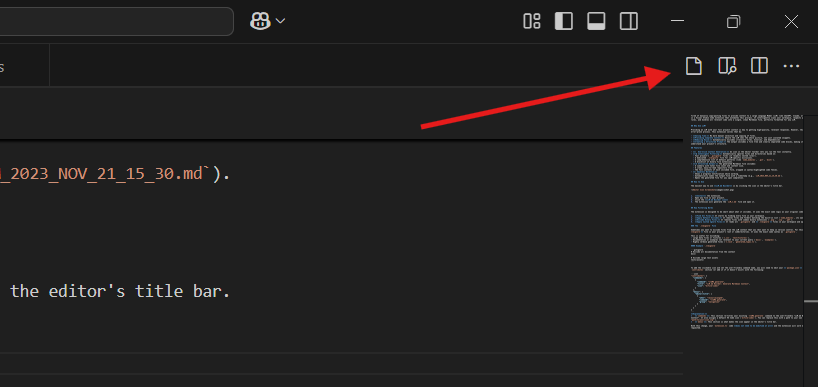

Tired of manually copy-pasting files to provide context to a Large Language Model (LLM) like ChatGPT, Claude, or Gemini? LLM.md Builder is a Visual Studio Code extension that automates this process. It intelligently scans your workspace, respects your existing `.gitignore` rules, and bundles all relevant code into a single, clean Markdown file, perfectly formatted for any LLM.


## Why Use LLM?

Providing an LLM with your full project context is key to getting high-quality, relevant responses. However, this is often a tedious and error-prone process. This extension solves that by:

- **Saving Time:** No more manual selection and copying of files.
- **Providing Complete Context:** Ensure the LLM sees the whole picture, not just isolated snippets.
- **Reducing Noise:** Automatically excludes irrelevant files, binaries, and dependencies.
- **Creating a Structured Prompt:** The output includes a file tree and clearly separated code blocks, making it easier for the LLM to understand your project's structure.

## Features

- **🚀 One-Click Context Generation:** An icon in the editor toolbar lets you run the tool instantly.
- **🧠 Intelligent Filtering:** Automatically ignores files and directories based on:
  - Your project's `.gitignore` files (it respects nested rules!).
  - A dedicated `.llmignore` file for LLM-specific exclusions.
  - A comprehensive list of default patterns (like `node_modules`, `.git`, `dist/`).
  - A blocklist of binary file extensions.
- **📁 Structured Output:** The generated Markdown file includes:
  - A summary with total file count and content size.
  - A clean, easy-to-read repository tree.
  - The full contents of each included file, wrapped in syntax-highlighted code fences.
- **✨ Seamless Workflow:**
  - Shows a progress notification while working.
  - Automatically names the output file with a timestamp (e.g., `LLM_2023_NOV_21_15_30.md`).
  - Opens the generated file for you upon completion.

## How to Use

The easiest way to use **LLM.md Builder** is by clicking the icon in the editor's title bar.




1.  **Install** the extension.
2.  Open any file in your project.
3.  Click the **LLM.md Builder icon**
4.  The extension will generate the `LLM_*.md` file and open it.


## How Filtering Works

The extension is designed to be smart about what it includes. It uses the exact same logic as your original code:

1.  **Find All Files:** It starts by finding every file in your workspace.
2.  **Apply Default Excludes:** It removes files and folders matching the built-in list (`node_modules`, its own output `LLM_*.md`, etc.).
3.  **Exclude Binary Files:** It removes files with common binary extensions (`.png`, `.zip`, `.pdf`).
4.  **Apply Custom Ignore Files:** It reads all `.gitignore` and **`.llmignore`** files in your workspace and applies their rules.

### The `.llmignore` File

Sometimes you want to exclude files from the LLM context that you *do* want to keep in version control. For this, create a **`.llmignore`** file in your project's root or subdirectories. It uses the exact same syntax as `.gitignore`.

This is useful for excluding:
- Large data files or fixtures (`*.csv`, `test/fixtures/`).
- Documentation or examples not relevant to your current query (`docs/`, `examples/`).
- Highly verbose generated files (`*.lock`, `generated_types.ts`).

#### Example `.llmignore`

```gitignore
# Exclude all documentation from the context
docs/

# Exclude large test assets
tests/assets/
```


To add the clickable icon and set the user-friendly command name, you will need to edit your **`package.json`** file. Replace the `contributes` section (or add it if it doesn't exist) with the following:

```json
"contributes": {
  "commands": [
    {
      "command": "llmMd.generate",
      "title": "LLM.md Builder: Generate Markdown Context",
      "icon": "$(file-code)"
    }
  ],
  "menus": {
    "editor/title": [
      {
        "when": "resourceLangId",
        "command": "llmMd.generate",
        "group": "navigation"
      }
    ]
  }
}
```
**Explanation:**
*   **`commands`**: This section re-titles your existing `llmMd.generate` command to the user-friendly "LLM.md Builder: Generate Markdown Context". It also assigns a default VS Code icon (`$(file-code)`). You can replace this with a path to your own SVG icon (e.g., `"icon": "path/to/your/icon.svg"`).
*   **`menus`**: This section is what makes the icon appear in the editor's title bar.

With this change, your `extension.ts` code **does not need to be modified at all** and the extension will work exactly as you've requested.